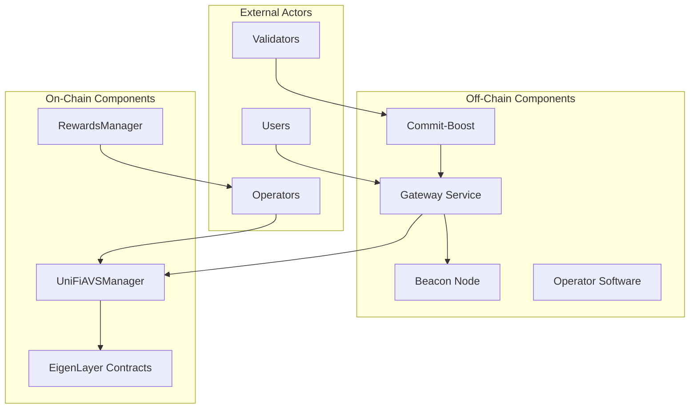
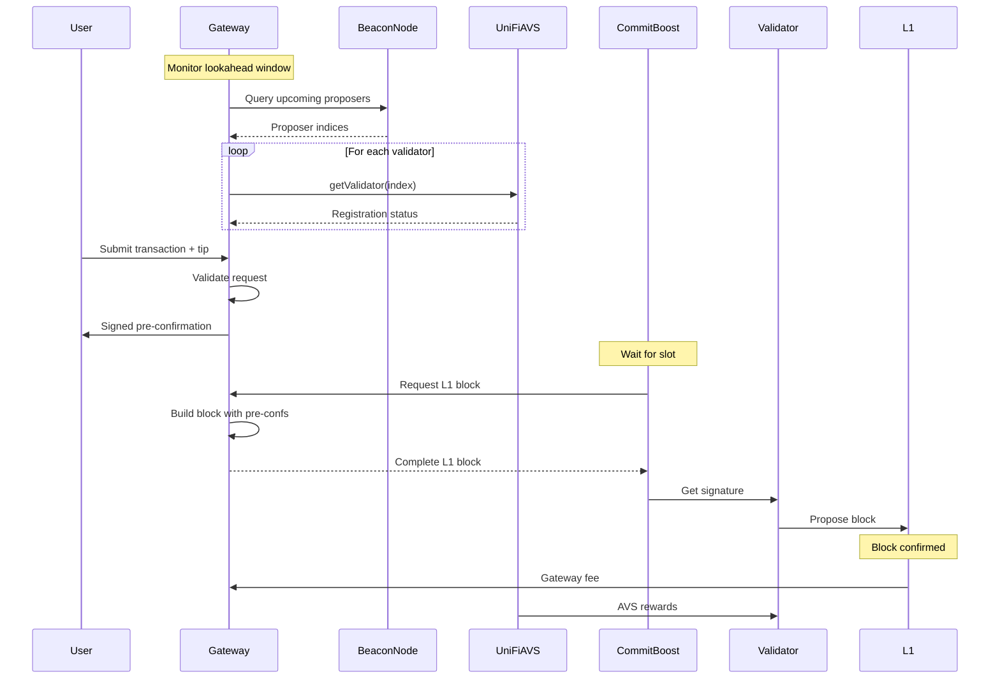

# UniFi AVS Agent Documentation

## Table of Contents

1. [Overview](#overview)
2. [Agent Architecture](#agent-architecture)
3. [Agent Types](#agent-types)
4. [Setup and Configuration](#setup-and-configuration)
5. [Registration Process](#registration-process)
6. [Pre-confirmation Flow](#pre-confirmation-flow)
7. [Contract Interfaces](#contract-interfaces)
8. [Rewards and Slashing](#rewards-and-slashing)
9. [API Reference](#api-reference)
10. [Deployment Guide](#deployment-guide)
11. [Security Considerations](#security-considerations)
12. [Troubleshooting](#troubleshooting)

## Overview

UniFi AVS (Actively Validated Service) is a based rollup solution that implements pre-confirmations on Ethereum. It leverages EigenLayer's infrastructure to provide near-instant transaction confirmations (~100ms) while maintaining Ethereum's security guarantees.

### Key Features

- **Fast Pre-confirmations**: Transaction confirmations in ~100ms instead of 12s
- **Based Rollup Architecture**: L1-sequenced rollup leveraging Ethereum validators
- **EigenLayer Integration**: Built on EigenLayer's AVS framework
- **MEV-Smoothing Rewards**: Stable reward distribution for validators
- **Commit-Boost Integration**: Standardized interface for proposer commitments

### System Components

- **Operators**: EigenLayer operators who register with UniFi AVS
- **Validators**: Ethereum validators that propose blocks with pre-confirmed transactions
- **Gateways**: Infrastructure that handles pre-confirmation requests and block building
- **Users**: Submit transactions seeking fast pre-confirmations

## Agent Architecture

The UniFi AVS agent system consists of multiple interacting components:



### Component Responsibilities

1. **Gateway Service**
   - Receives pre-confirmation requests
   - Signs pre-confirmations with delegate keys
   - Builds L1 blocks with pre-confirmed transactions
   - Monitors validator lookahead windows

2. **Operator Software**
   - Manages registration with UniFi AVS
   - Sets delegate keys for Gateway operations
   - Claims rewards from the system

3. **Commit-Boost Integration**
   - Interfaces between validators and Gateway
   - Requests blocks at proposal time
   - Ensures proposer commitment compliance

## Agent Types

### 1. Operator Agent

**Role**: Manages EigenLayer operator participation in UniFi AVS

**Responsibilities**:
- Register with UniFi AVS
- Set operator commitments (delegate keys and supported chains)
- Manage validator registrations
- Claim AVS rewards

**Requirements**:
- Registered EigenLayer operator
- Minimum stake requirements met
- Valid delegate key for Gateway operations

### 2. Gateway Agent

**Role**: Handles pre-confirmation operations and block building

**Responsibilities**:
- Accept and validate pre-confirmation requests
- Sign pre-confirmations with delegate keys
- Monitor validator lookahead windows
- Build and deliver L1 blocks to validators
- Track and report pre-confirmation fulfillment

**Requirements**:
- High-availability infrastructure
- Access to beacon node
- Delegate key authorization from operators
- Low-latency network connectivity

### 3. Validator Agent (via Commit-Boost)

**Role**: Proposes blocks with pre-confirmed transactions

**Responsibilities**:
- Run Commit-Boost alongside validator client
- Request blocks from Gateway at proposal time
- Propose blocks containing pre-confirmed transactions
- Maintain validator registration with UniFi AVS

**Requirements**:
- Active Ethereum validator
- Commit-Boost installation
- Registration with UniFi AVS
- Delegation to a Gateway

## Setup and Configuration

### Prerequisites

1. **For Operators**:
   - EigenLayer operator registration completed
   - Sufficient restaked ETH
   - Access to UniFi AVS contracts

2. **For Gateways**:
   - High-performance server infrastructure
   - Beacon node access
   - Secure key management system

3. **For Validators**:
   - Running Ethereum validator
   - Commit-Boost compatible setup
   - Operator relationship established

### Operator Setup

```bash
# 1. Install UniFi CLI tools
npm install -g @unifi/cli

# 2. Configure operator environment
export OPERATOR_ADDRESS=0x...
export PRIVATE_KEY=0x...
export RPC_URL=https://...

# 3. Register with UniFi AVS
unifi operator register \
  --avs-contract $UNIFI_AVS_MANAGER \
  --eigenlayer-signature $SIGNATURE

# 4. Set operator commitment
unifi operator set-commitment \
  --delegate-key $GATEWAY_PUBKEY \
  --chain-ids 1,10,8453
```

### Gateway Setup

```bash
# 1. Install Gateway software
git clone https://github.com/puffer/unifi-gateway
cd unifi-gateway
make install

# 2. Configure Gateway
cat > config.yaml <<EOF
beacon_node: "http://localhost:5052"
delegate_key: "0x..."
avs_manager: "0x..."
rpc_endpoints:
  - "http://localhost:8545"
chain_ids: [1, 10, 8453]
EOF

# 3. Start Gateway service
unifi-gateway start --config config.yaml
```

### Validator Setup with Commit-Boost

```bash
# 1. Install Commit-Boost
curl -L https://commit-boost.io/install.sh | bash

# 2. Configure Commit-Boost for UniFi
cat > commit-boost.toml <<EOF
[unifi]
enabled = true
gateway_url = "https://gateway.unifi.network"
delegate_key = "0x..."

[validator]
fee_recipient = "0x..."
EOF

# 3. Start Commit-Boost with validator
commit-boost start --config commit-boost.toml
```

## Registration Process

### Operator Registration Flow

```solidity
// 1. Register as EigenLayer Operator (if not already)
IDelegationManager.registerAsOperator(operatorDetails, metadataURI);

// 2. Register with UniFi AVS
IUniFiAVSManager.registerOperator(eigenLayerSignature);

// 3. Set Operator Commitment
IUniFiAVSManager.setOperatorCommitment(
    OperatorCommitment({
        delegateKey: gatewayPublicKey,
        chainIds: [1, 10, 8453]
    })
);

// 4. Register Validators
IUniFiAVSManager.registerValidators(validatorInfos);
```

### Validator Registration Requirements

1. **Validator must be active on beacon chain**
2. **Associated operator must be registered**
3. **Valid withdrawal credentials pointing to EigenPod**
4. **Commitment must be set with valid delegate key**

## Pre-confirmation Flow

### Detailed Flow Sequence



### Pre-confirmation Request Format

```json
{
  "transaction": {
    "to": "0x...",
    "data": "0x...",
    "value": "1000000000000000000",
    "gasLimit": "21000",
    "maxFeePerGas": "50000000000",
    "maxPriorityFeePerGas": "2000000000"
  },
  "preconfTip": "100000000000000000",
  "chainId": 1,
  "deadline": 1699564800
}
```

### Pre-confirmation Response

```json
{
  "preconfirmation": {
    "transactionHash": "0x...",
    "gatewaySignature": "0x...",
    "delegateKey": "0x...",
    "slot": 7890123,
    "inclusionDeadline": 7890125
  },
  "status": "accepted"
}
```

## Contract Interfaces

### UniFiAVSManager

```solidity
interface IUniFiAVSManager {
    // Operator Management
    function registerOperator(
        ISignatureUtils.SignatureWithSaltAndExpiry memory operatorSignature
    ) external;
    
    function setOperatorCommitment(
        OperatorCommitment calldata commitment
    ) external;
    
    function startDeregisterOperator() external;
    function finishDeregisterOperator() external;
    
    // Validator Management
    function registerValidators(
        ValidatorInfo[] calldata validatorInfos
    ) external;
    
    function deregisterValidators(
        uint40[] calldata validatorIndices
    ) external;
    
    // Queries
    function getValidator(uint40 validatorIndex) 
        external view returns (ValidatorInfo memory);
    
    function getOperatorCommitment(address operator)
        external view returns (OperatorCommitment memory);
        
    // Rewards
    function submitOperatorRewards(
        OperatorReward[] calldata rewards
    ) external;
}
```

### Data Structures

```solidity
struct OperatorCommitment {
    bytes delegateKey;      // Public key for pre-conf signing
    uint256[] chainIds;     // Supported chain IDs
}

struct ValidatorInfo {
    bytes pubkey;           // 48-byte BLS public key
    bytes signature;        // Registration signature
    bytes32 depositDataRoot;
    address eigenPod;       // Associated EigenPod address
    uint40 validatorIndex;  // Beacon chain index
}

struct OperatorReward {
    address operator;
    uint256 amount;
    uint32 startTimestamp;
    uint32 endTimestamp;
}
```

## Rewards and Slashing

### Reward Distribution

1. **Pre-confirmation Tips**
   - Users pay tips for fast confirmations
   - Tips go directly to Gateway operators

2. **AVS Rewards**
   - Block rewards minus Gateway fees
   - Distributed bi-weekly to operators
   - Based on validator participation

3. **Claiming Process**
   ```solidity
   // Operators claim from RewardsManager
   IRewardsManager.processClaim(
       operator,
       rewardTokens,
       cumulativeRewards,
       merkleProof
   );
   ```

### Slashing Conditions

1. **Safety Faults**
   - Equivocation: Signing conflicting pre-confirmations
   - Invalid pre-confirmations: Promising impossible inclusions
   - Penalty: Up to 100% of stake

2. **Liveness Faults**
   - Failure to include pre-confirmed transactions
   - Penalty: Proportional to missed commitments

### Slashing Process

```solidity
// Submit slashing proof
ISlashingManager.submitSlashingProof(
    SlashingProof({
        operator: faultyOperator,
        validatorIndex: validatorIndex,
        faultType: FaultType.EQUIVOCATION,
        evidence: proofData
    })
);
```

## API Reference

### Gateway RPC API

#### Submit Pre-confirmation Request
```http
POST /preconf/submit
Content-Type: application/json

{
  "transaction": {...},
  "preconfTip": "100000000000000000",
  "chainId": 1
}
```

#### Query Pre-confirmation Status
```http
GET /preconf/status/{transactionHash}
```

#### Get Gateway Info
```http
GET /gateway/info

Response:
{
  "delegateKey": "0x...",
  "supportedChains": [1, 10, 8453],
  "currentSlot": 7890123,
  "activeValidators": 150
}
```

### Monitoring Endpoints

#### Health Check
```http
GET /health

Response:
{
  "status": "healthy",
  "uptime": 3600,
  "version": "1.0.0"
}
```

#### Metrics
```http
GET /metrics

Response (Prometheus format):
# HELP preconfs_total Total pre-confirmations issued
# TYPE preconfs_total counter
preconfs_total{chain="1"} 10000

# HELP preconf_latency_ms Pre-confirmation latency
# TYPE preconf_latency_ms histogram
preconf_latency_ms_bucket{le="100"} 9500
```

## Deployment Guide

### Mainnet Deployment

1. **Contract Addresses**
   ```yaml
   UniFiAVSManager: "0x..."
   RewardsManager: "0x..."
   AccessManager: "0x..."
   ```

2. **Network Requirements**
   - Ethereum RPC endpoint with archive access
   - Beacon node with REST API enabled
   - Minimum 32GB RAM for Gateway operations

3. **Security Checklist**
   - [ ] Secure key storage (HSM recommended)
   - [ ] Firewall rules configured
   - [ ] DDoS protection enabled
   - [ ] Monitoring and alerting setup
   - [ ] Backup and recovery procedures

### Testnet Deployment (Holesky)

1. **Faucets and Resources**
   - Holesky ETH faucet: https://holesky-faucet.io
   - Test validator setup guide
   - Testnet Gateway endpoints

2. **Test Configuration**
   ```yaml
   # Reduced requirements for testing
   min_stake: "1 ether"
   deregistration_delay: 3600  # 1 hour
   ```

## Security Considerations

### Key Management

1. **Delegate Keys**
   - Store in secure key management system
   - Rotate regularly (recommended: monthly)
   - Never expose private keys in logs

2. **Operator Keys**
   - Use hardware security modules (HSM)
   - Implement multi-signature schemes
   - Regular security audits

### Network Security

1. **Gateway Protection**
   - Rate limiting on RPC endpoints
   - IP allowlisting for critical operations
   - TLS encryption for all communications

2. **DoS Prevention**
   - Request validation and sanitization
   - Resource usage limits
   - Circuit breakers for downstream services

### Operational Security

1. **Monitoring**
   - Real-time alerts for anomalies
   - Performance metrics tracking
   - Slashing risk indicators

2. **Incident Response**
   - Documented escalation procedures
   - Automated failover mechanisms
   - Regular disaster recovery drills

## Troubleshooting

### Common Issues

#### Registration Failures

**Problem**: "Operator not registered with EigenLayer"
```bash
# Solution: First register with EigenLayer
cast send $DELEGATION_MANAGER "registerAsOperator(...)"
```

**Problem**: "Invalid validator withdrawal credentials"
```bash
# Solution: Ensure validator points to correct EigenPod
cast call $EIGEN_POD_MANAGER "getPod(address)" $OPERATOR
```

#### Pre-confirmation Issues

**Problem**: "Pre-confirmation not included in block"
- Check Gateway logs for block building errors
- Verify validator is registered and active
- Ensure sufficient gas prices in transactions

**Problem**: "Gateway connection timeout"
- Verify network connectivity
- Check firewall rules
- Validate Gateway endpoint configuration

### Debug Commands

```bash
# Check operator status
unifi operator status --address $OPERATOR

# Verify validator registration
unifi validator check --index $VALIDATOR_INDEX

# Test Gateway connectivity
curl -X GET https://gateway.url/health

# Monitor pre-confirmation queue
unifi gateway monitor --follow
```

### Log Analysis

```bash
# Gateway logs
journalctl -u unifi-gateway -f

# Search for specific errors
grep -E "ERROR|WARN" /var/log/unifi/gateway.log

# Performance analysis
unifi analyze-logs --start "1 hour ago" --metrics
```

## Appendix

### Glossary

- **AVS**: Actively Validated Service
- **Pre-conf**: Pre-confirmation
- **MEV**: Maximum Extractable Value
- **PBS**: Proposer-Builder Separation
- **Based Rollup**: L1-sequenced rollup

### References

- [UniFi Litepaper](https://unifi.puffer.fi/files/Puffer-UniFi-Litepaper.pdf)
- [EigenLayer Documentation](https://docs.eigenlayer.xyz)
- [Commit-Boost Specification](https://commit-boost.io/spec)
- [Ethereum Beacon APIs](https://ethereum.github.io/beacon-APIs)

### Support Channels

- Discord: https://discord.gg/pufferfi
- GitHub: https://github.com/puffer/unifi-avs
- Email: support@puffer.fi
